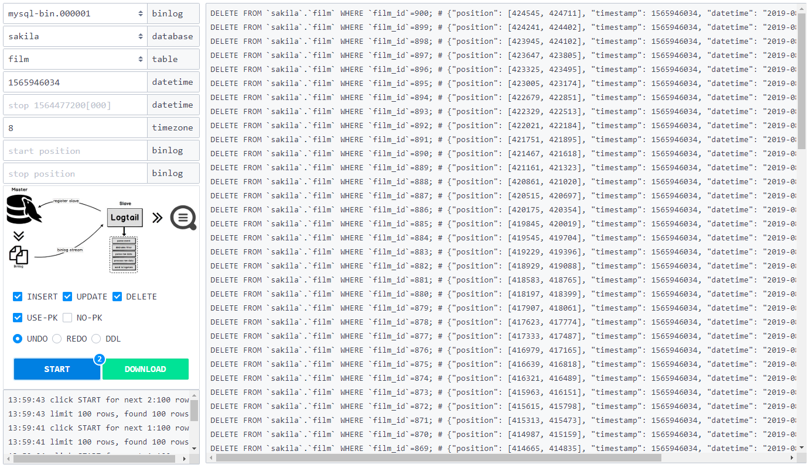

## 仓库
the binlog-repository of mysql CDC(Change Data Capture)  
利用[pymysqlreplication](https://github.com/noplay/python-mysql-replication)进行`binlog`实时解析，保存至`InfluxDB`时序数据库，并提供`web`界面生成标准`undo sql, redo sql, ddl sql`  

## 界面
- static/example-dml.png


- static/example-ddl.png


## 使用
### 1. 前提  
binlog解析使用定制版的[nloneday/pymysqlreplication](https://github.com/nloneday/python-mysql-replication)，因此得单独安装。
```shell
pip install -r requirements
pip uninstall -y mysql-replication
python setup.py build
python setup.py install
```
### 2. 配置
```ini
[mysql]
host = localhost
port = 3306
username = root
password = 123456
charset = utf8
binlog-file = mysql-bin.000001 # start binlog file

[influx]
host = localhost
port = 8086
username = root
password = 123456
database = binlog
retention = 7d # expire time, 7 days
check-table = binlog_check # the table of saving write checkpoint
cache-size = 1000 # cache size before write, not write per binlog event
batch-size = 2000 # write batch size

[web]
port = 3000
output-size = 10000 # output sql limit

[other]
log-level = INFO # DEBUG, INFO, WARNING
```
### 3. 运行
```bash
# 请先修改本地project.ini中的参数
python run.py
```
```bash
# 打包镜像
docker build -t binlog-repository:2019-08-19 .

# $PWD/project.ini，请先在本地创建project.ini并修改参数，然后挂载
# 如果想省去docker打包的环节，可使用已有镜像nandy/binlog-repository:2019-08-19
docker run --name binlog-repository --restart always -d -p3000:3000 \
    -v $PWD/project.ini:/app/project.ini binlog-repository:2019-08-19
```

## 解析
- 原始
```
# INSERT
{
    "time":1565946034,
    "file":"mysql-bin.000001",
    "database":"sakila",
    "table":"actor",
    "type":"INSERT",
    "key":"["actor_id"]",
    "pos":27298,
    "end_log_pos":31440,
    "exec_time":0,
    "data":"{"actor_id": 1, "first_name": "PENELOPE", "last_name": "GUINESS", "last_update": "2006-02-15 04:34:33"}",
    "xid":4142
}

# UPDATE
{
    "time":1565946609,
    "file":"mysql-bin.000001",
    "database":"sakila",
    "table":"actor",
    "type":"UPDATE",
    "key":"["actor_id"]",
    "pos":1361450,
    "end_log_pos":1361534,
    "exec_time":0,
    "data":"{"actor_id": 1, "first_name": "PENELOPE", "last_name": "GUINESS", "last_update": "2019-02-15 04:34:33"}",
    "old":"{"actor_id": 1, "first_name": "PENELOPE", "last_name": "GUINESS", "last_update": "2006-02-15 04:34:33"}",
    "xid":5243
}

# DELETE
{
    "time":1565946761,
    "file":"mysql-bin.000001",
    "database":"sakila",
    "table":"payment",
    "type":"DELETE",
    "key":"["payment_id"]",
    "pos":1361766,
    "end_log_pos":1361823,
    "exec_time":0,
    "data":"{"payment_id": 1, "customer_id": 1, "staff_id": 1, "rental_id": 76, "amount": "2.99", "payment_date": "2005-05-25 11:30:37", "last_update": "2006-02-15 22:12:30"}",
    "xid":5293
}

# DDL
{
    "time":1565945996,
    "file":"mysql-bin.000001",
    "database":"sakila",
    "table":"",
    "type":"DDL",
    "key":"[]",
    "pos":747,
    "end_log_pos":847,
    "exec_time":0,
    "data":"DROP DATABASE `sakila`",
    "xid":4142
}
```
- 存储
```
# 因为InfluxDB不支持json，所以字段key、data、old先转换成base64之后存储
data = data.encode()
data = base64.b64encode(data).decode()
# 读取的时候再转换回来
data = base64.b64decode(data).decode()
```

## 其它
### 1. influxdb
- max-series-per-database = 0 # 最大series不限制
- max-values-per-tag = 0 # 最大values不限制

```
Connected to http://localhost:8086 version 1.7.7
InfluxDB shell version: 1.7.7
>
> use binlog
Using database binlog
>
> show measurements
name: measurements
name
----
binlog_check
binlog_localhost_3306
```
```
> show tag keys
name: binlog_check
tagKey
------
table

name: binlog_localhost_3306
tagKey
------
database
file
table
type
xid
```
```
> show field keys
name: binlog_check
fieldKey    fieldType
--------    ---------
end_log_pos integer
file        string
pos         integer
timestamp   integer
xid         integer

name: binlog_localhost_3306
fieldKey    fieldType
--------    ---------
data        string
end_log_pos integer
exec_time   integer
key         string
old         string
pos         integer
```

### 2. 测试数据集
[sakila database](https://dev.mysql.com/doc/index-other.html) MySQL示例数据库

### 3. BUG反馈
- 已知bug（无奈...）  
json，geometry字段类型导致where条件失效；delimiter缺失导致部分ddl执行失败。以上，需留意并手动修改

- 反馈bug  
无论是定制版`pymysqlreplication`还是`binlog-repository`项目，欢迎issues。