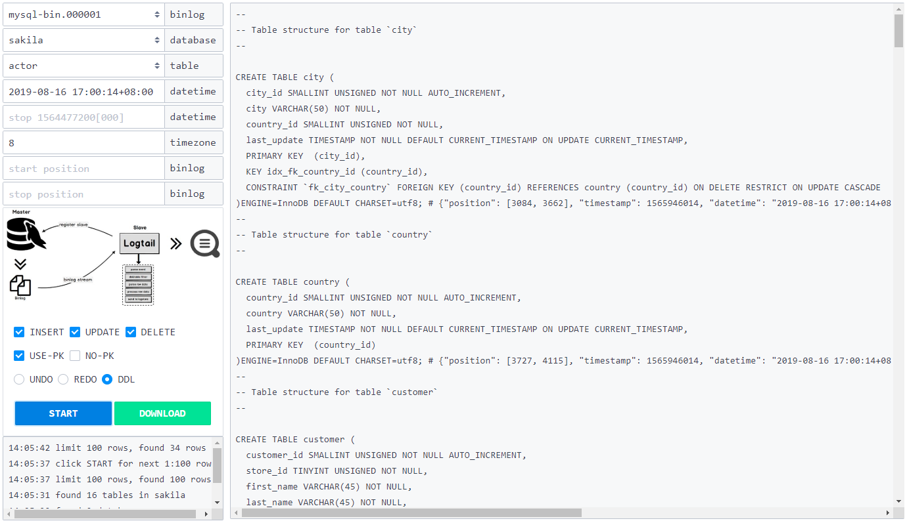

## 仓库
the binlog-repository of mysql CDC(Change Data Capture)  
利用[pymysqlreplication](https://github.com/noplay/python-mysql-replication)进行`binlog`实时解析，保存至`InfluxDB`时序数据库，并提供`web`界面生成标准`undo sql, redo sql, ddl sql`  

## 界面
- static/example-dml.png


- static/example-ddl.png


## 使用
### 1. 前提  
binlog解析使用定制版的[nloneday/pymysqlreplication](https://github.com/nloneday/python-mysql-replication)，因此得单独安装。
```shell
pip install -r requirements
pip uninstall -y mysql-replication
python setup.py build
python setup.py install
```
### 2. 配置
```ini
[mysql]
host = localhost
port = 3306
username = root
password = 123456
charset = utf8
binlog-file = mysql-bin.000001 # start binlog file

[influx]
host = localhost
port = 8086
username = root
password = 123456
database = binlog
retention = 7d # expire time, 7 days
check-table = binlog_check # the table of saving write checkpoint
cache-size = 1000 # cache size before write, not write per binlog event
batch-size = 2000 # write batch size

[web]
port = 3000
output-size = 10000 # output sql limit

[other]
log-level = INFO # DEBUG, INFO, WARNING
```
### 3. 运行
```shell
python run.py
```

## 其它
### 1. influxdb
- max-series-per-database = 0 # 最大series不限制
- max-values-per-tag = 0 # 最大values不限制

```
Connected to http://localhost:8086 version 1.7.7
InfluxDB shell version: 1.7.7
>
> use binlog
Using database binlog
>
> show measurements
name: measurements
name
----
binlog_check
binlog_localhost_3306
```
```
> show tag keys
name: binlog_check
tagKey
------
table

name: binlog_localhost_3306
tagKey
------
database
file
table
type
xid
```
```
> show field keys
name: binlog_check
fieldKey    fieldType
--------    ---------
end_log_pos integer
file        string
pos         integer
timestamp   integer
xid         integer

name: binlog_localhost_3306
fieldKey    fieldType
--------    ---------
data        string
end_log_pos integer
exec_time   integer
key         string
old         string
pos         integer
```

### 2. 测试数据集
[sakila database](https://dev.mysql.com/doc/index-other.html) MySQL示例数据库

### 3. BUG反馈
无论是定制版`pymysqlreplication`还是`binlog-repository`项目，欢迎issue